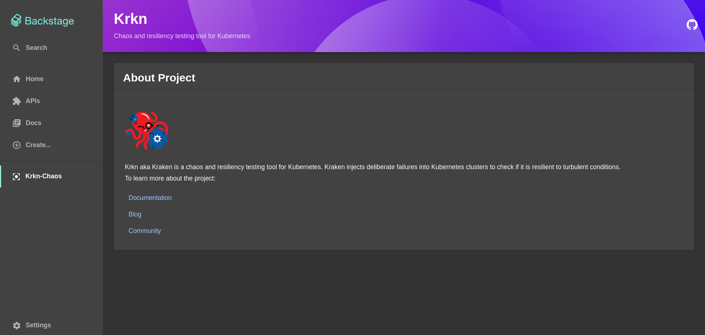

# backstage-plugin-krkn-chaos

This backstage plugin is a Proof Of Concept for bringing [Krkn-Chaos](https://krkn-chaos.dev/) into Backstage and RHDH.



_This plugin was created through the Backstage CLI_


## Installation

**Prerequisites**

Make sure you have a running Backstage or RHDH instance and if you don't have one, then you can setup a basic backstage app by following this [getting started](https://backstage.io/docs/getting-started/) guide.

1. Clone this repository into backstage's plugin directory.
  ```
  # From the root of backstage directory
  cd plugins
  git clone https://github.com/rh-rahulshetty/krkn-backstage-plugin.git
  ```

2. Add the package in the `packages/app/package.json`
  ```
  "@internal/backstage-plugin-backstage-plugin-krkn-chaos": "^0.1.0",
  ```


3. Add Route in `packages/app/src/App.tsx`:

  ```tsx title="packages/app/src/App.tsx"
   /* highlight-add-next-line */
   import { BackstagePluginKrknChaosPage } from '@internal/backstage-plugin-backstage-plugin-krkn-chaos';

   <Route path="/krkn-chaos" element={<BackstagePluginKrknChaosPage />} />
   ```

4. Add your plugin as a Sidebar Item in `packages/app/src/components/Root/Root.tsx`:

  ```tsx title="packages/app/src/components/Root/Root.tsx"
   /* highlight-add-next-line */
   import CenterFocusStrongIcon from '@material-ui/icons/CenterFocusStrong';

   export const Root = ({ children }: PropsWithChildren<{}>) => (
    <SidebarPage>
      <Sidebar>
        ...
        <SidebarItem icon={CenterFocusStrongIcon} to="krkn-chaos" text="Krkn-Chaos"/>
        ...
      <Sidebar>
    </SidebarPage>
   );
  ```

6. From the backstage root directory and the plugins directory, run `yarn` command to install any missing NPM dependencies.

7. Start your application from the root directory, and then navigate to [/krkn-chaos}](http://localhost:3000/krkn-chaos).

